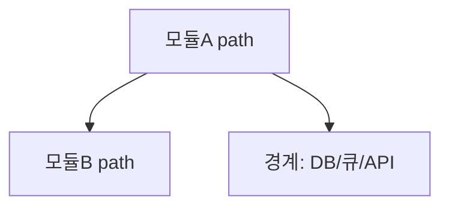

# process-map: {프로젝트명}

> JIT 프로젝트 구조 캐시 (playbooks/process-map.md). **작업에 필요한 구조만** — 전수 문서화 아님.
> 최종 갱신: {날짜} · 갱신 계기: {작업명/커밋}

## 1. 프로세스 흐름

> 이 프로젝트의 핵심 실행 경로 1~3개. 진입점 → 단계 → 산출.

- **{플로우명}**: {진입점}에서 시작 → {핵심 단계} → {산출/부작용}. 파일: `path:line`.

## 2. 엔티티·의존 그래프

> 핵심 모듈/객체와 방향성 의존 (A --> B = A가 B에 의존).

## 3. 경계 객체의 역할

> 마지막 단(외부 계약·DB·큐·API·스키마)이 보장/책임지는 것.

| 경계 객체 | 파일 | 보장/책임 (불변식) |
|-----------|------|------|
| {예: OrderRepository} | `path:line` | {예: 주문 상태 전이 원자성·중복 삽입 차단} |

## open questions (애매한 것 — 단정 말고 남긴다)

- {예: 재시도 경로에서 dedup 키는 어디서 보장되나?}
